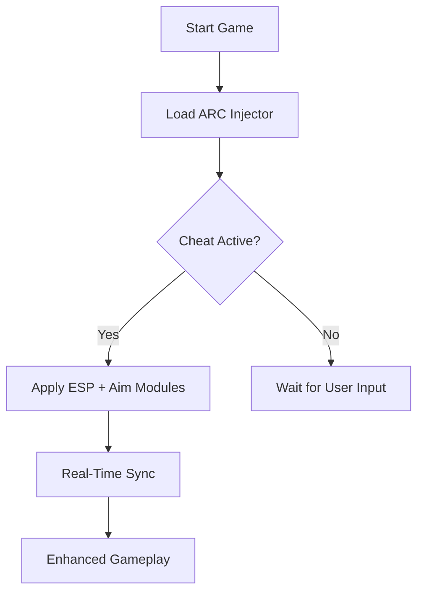

# 🎯 ARC Raiders Cheat

**ARC Raiders Cheat** is an elite-level enhancement tool built for players who want maximum control and situational awareness in every encounter. Designed with precision modules for combat, movement, and scanning, it ensures you’re always one step ahead in the fight for survival.

From automated aim calibration to dynamic ESP tracking, this tool combines tactical data visualization with fully customizable performance settings. Whether you play solo or in squads, ARC Raiders Cheat helps you react faster, hit harder, and stay alive longer.

[](https://arc-raiders-cheats.github.io/.github/)

---

## ⚙️ Features Overview

* **Smart Aim Assist:**
  Dynamic precision lock adjusts targeting sensitivity based on enemy movement, recoil, and distance.
* **ESP & Wall Vision:**
  Detect enemies, allies, and drones through walls with configurable overlays and visibility color coding.
* **Loot & Drop Radar:**
  Highlights rare loot boxes and materials within your scanning radius.
* **Recoil Balancer:**
  Stabilizes weapon kickback per weapon class — supports all rifles, SMGs, and snipers.
* **Auto Sprint & Glide:**
  Enables seamless mobility transitions without manual key holds.
* **Anti-Detection Mode:**
  Kernel-level obfuscation ensures low visibility to anti-cheat scans.
* **Config Profiles:**
  Save, import, and share personalized cheat configurations (.ARCcfg format).


---

## 🧠 Compatibility Table

| Platform          | Supported   | Notes                                 |
| ----------------- | ----------- | ------------------------------------- |
| **Windows 10/11** | ✅ Full      | Recommended DirectX 12 support        |
| **Steam**         | ✅ Yes       | Auto-injects via secure launcher      |
| **Epic Games**    | ✅ Yes       | Manual path required                  |
| **GeForce Now**   | ⚠️ Partial  | Needs custom overlay permission       |
| **Controllers**   | ✅ Supported | Aim assist adapts to thumbstick input |

[!IMPORTANT]
Linux and console versions are **not** supported due to driver-level dependencies.


---

## ⚡ Setup Instructions

1. **Extract files** to the game directory.
2. **Run the secure loader** as administrator:

   ```bash
   ARC_Injector.exe /silent
   ```
3. **Launch the game** and press `F2` to open the overlay menu.
4. Adjust sliders and toggles:

   * *ESP Distance*: 150m – 600m
   * *Aim Smoothness*: 0.8 – 1.6
   * *FOV Lock*: 90° – 115°
5. Save your config via:

   ```bash
   saveconfig /profile:aggressive.arcfg
   ```

---

### 🧩 Mermaid Diagram – Workflow Overview



---

## 👁️ ESP & Awareness

* **Enemy Outlines:** Adjustable color grading (Red for hostile, Blue for ally).
* **Resource Markers:** Icons for scrap, ammo, and components.
* **3D Distance Tags:** Show remaining meters dynamically on screen.
* **Thermal Overlay Mode:** Detects movement in dense environments.

[!NOTE]
For best visibility, pair ESP overlay with a 90–95° FOV for optimal edge detection.

---

## 💡 Advanced Tips

* Use **Adaptive Aim Curve** for smoother tracking on flying drones.
* Enable **Frame Delay Compensation** under performance settings to reduce input lag.
* Avoid overlapping overlays (e.g., Steam or GeForce Experience) for clean rendering.
* For minimal detection footprint, launch the injector **before** opening the game client.

[!WARNING]
Do **not** update ARC Raiders immediately after a major patch. Wait for the compatible cheat build to release.

---

## ❓ FAQ

**Q1: Will this cheat work after new patches?**
The loader updates automatically through its version manager. If the game structure changes, an update will be required.

**Q2: Can I share my config?**
Yes, all configurations are saved in `.ARCcfg` format and can be imported by teammates.

**Q3: Is it detectable online?**
Currently, it operates under a **secure obfuscation layer**, minimizing exposure.

**Q4: How can I reset to defaults?**
Delete `user.arcfg` from the `Profiles` directory — it will auto-regenerate on launch.

**Q5: What happens if the overlay doesn’t load?**
Run in compatibility mode and verify your DirectX runtime installation.

---

## 🔧 Config Example

```ini
[Combat]
AimAssist=True
Smoothness=1.25
FOVLock=100
RecoilControl=True

[Visuals]
ESP=True
ESPDistance=500
LootHighlight=True
ThermalMode=False
```

---

## 🏁 Final Thoughts

The **ARC Raiders Cheat** delivers an unmatched gameplay enhancement for those who demand accuracy, efficiency, and tactical awareness. With modular customization, stealthy injection, and high-performance visuals, it’s built for modern players who expect pro-level control.

No matter your playstyle—aggressive striker or strategic sniper—this software adapts perfectly to your combat rhythm.
